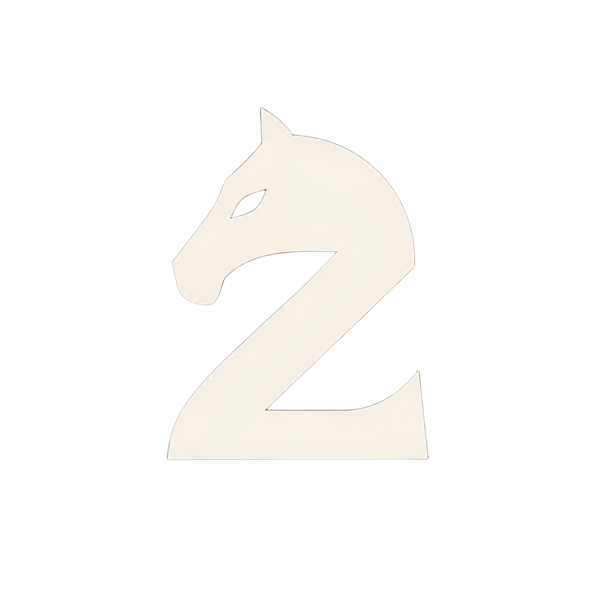

<div align="center">


# ZChess

</div>

---
## About

**ZChess** is a chess engine written from scratch in **C++17**.

The project started as a way to better understand how chess engines work internally, including board representation, move generation, legal move validation, search algorithms, and engine optimization.

The goal is to build the engine progressively while keeping the code simple, readable, and easy to understand.

---

## Development Progress

* [x] Board representation
* [x] Legal move generation
* [x] Castling / En passant / Promotion
* [x] Perft validation
* [ ] Alpha-beta search
* [ ] UCI protocol
* [ ] Graphical interface
* [ ] Move animations
* [ ] Transposition table
* [ ] Iterative deepening
* [ ] Time management
* [ ] Opening book

---

## Current Features

ZChess currently supports:

* Standard 8×8 chess board representation
* FEN parsing
* Legal move generation
* Check detection
* Move validation
* Castling
* En passant
* Pawn promotion
* Make / unmake move logic
* Perft testing

---

## Project Structure

```text
ZChess/
├── include/
│   └── chess.hpp
│
├── src/
│   ├── chess.cpp
│   └── main.cpp
│
├── tests/
│   └── perft.sh
│
├── ZChess.png
├── Makefile
├── CMakeLists.txt
└── README.md
```

---

## Build

### Requirements

* Linux
* C++17 compatible compiler
* Make

Compile the project with:

```bash
make
```

Run it with:

```bash
./zakaria_chess
```

Clean generated files:

```bash
make clean
```

Rebuild everything:

```bash
make re
```

---

## Perft Testing

Perft is used to verify the correctness of the move generator.

Run:

```bash
./tests/perft.sh
```

Or manually:

```bash
./zakaria_chess --perft 4
```

Expected result from the standard starting position:

```text
Depth 1: 20
Depth 2: 400
Depth 3: 8902
Depth 4: 197281
```

These values are commonly used to validate chess move generators.

---

## Roadmap

The next stages of development will focus on making ZChess capable of actually choosing strong moves.

Planned work includes:

```text
Evaluation function
        ↓
Negamax search
        ↓
Alpha-beta pruning
        ↓
Move ordering
        ↓
UCI support
        ↓
Graphical interface
        ↓
Search optimizations
```

Later versions will explore more advanced techniques such as transposition tables, iterative deepening, quiescence search, better time management, and stronger positional evaluation.

---

## Why ZChess?

The name combines:

```text
Z       → Zakaria
Chess   → the engine itself
```

The logo also combines the shape of a chess knight with the letter **Z**.

---

## Author

**Zakaria El Mountassir**

Software Engineering Student at **1337 / 42 Network**

GitHub: [zm-x](https://github.com/zm-x)

LinkedIn: [zakaria-mountassire](https://www.linkedin.com/in/zakaria-mountassire/)

---

## Status

ZChess is currently under active development.

The engine is being built incrementally, with each version introducing new functionality and improving the previous implementation.

---

<div align="center">

### `ZChess — built from the board up.`

</div>
